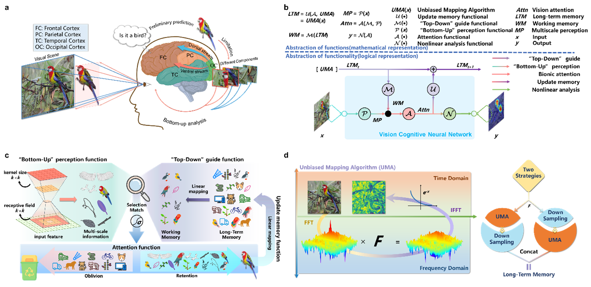
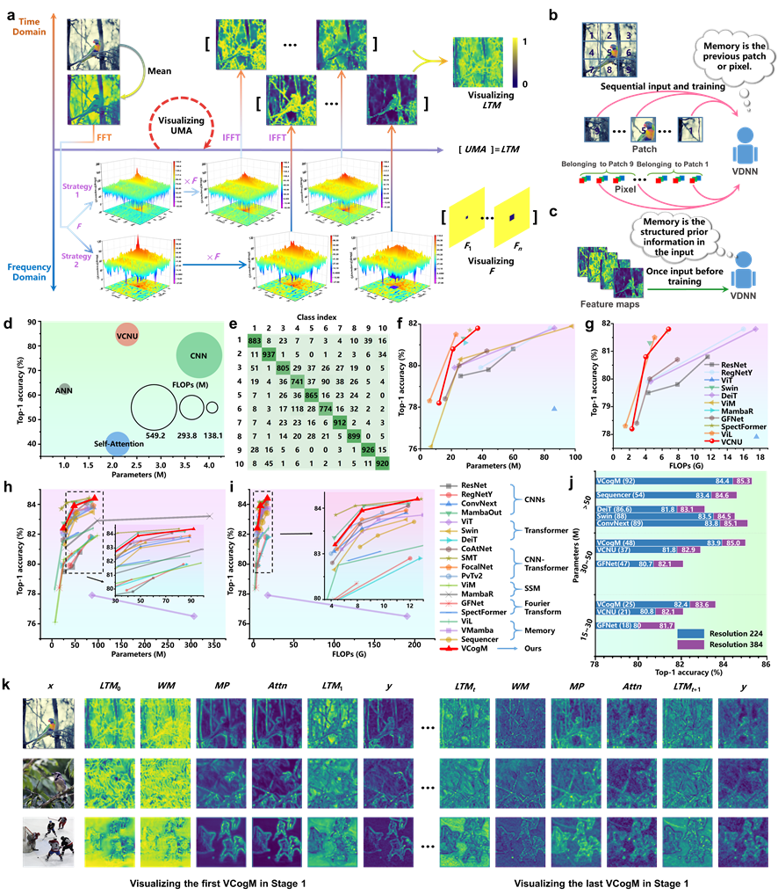
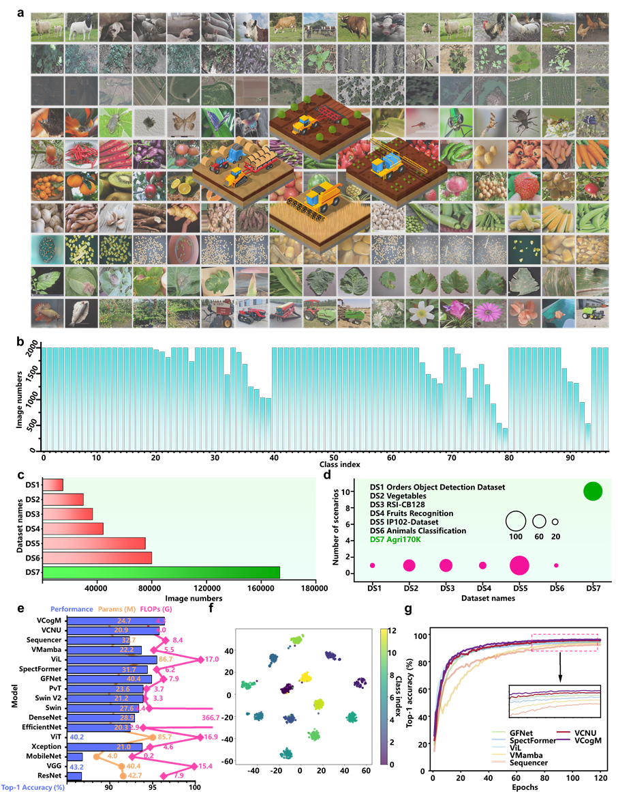

<div align="center">

<h1>The potential of cognitive-inspired neural network modeling framework <br /> for computer vision processing tasks <br /></h1> 

<div>
    <a>Guorun Li</a>;
    <a>Lei Liu</a>;
    <a>Xiaoyu Li</a>;
    <a>Yuefeng Du*</a>;
</div>

<h3><strong>submitted to Advanced Science in 2025</strong></h3>

</div>


## 🏠 TODOs

* [X] training and validation code.
* [X] Agri170K dataset (val).
* [ ] Agri170K dataset (train-val).
* [ ] Release the checkpoints.


## 🏠 Abstract
Visual computation models represented by deep neural networks (VDNNs) focus on replicating the selection of human visual attention, not the full spectrum of visual cognition, reflecting the divide between cognitive science (CS) and artificial intelligence (AI). To address this problem, we propose a cognitive modeling framework (CMF) that consists of three steps: abstracting cognitive function using functional, instantiating information transfer pipelines, and finally algorithmizing functional. Key challenges include modeling memory in VDNNs. We define memory in VDNNs as a priori information consisting of basic features in an image. We then introduce the Unbiased Mapping Algorithm (UMA), which uses the Fast Fourier Transform and statistical methods to model the priori information as long-term memory. Based on CMF and UMA, we develop the Visual Cognitive Neural Unit and Model, achieving top performance in various recognition tasks including natural scenes and smart agriculture. This work promotes the integration of AI and CS.


## 🏠 Overview




## 🎁 Train and Test
We have provided detailed instructions for model training and testing and experimental details. 
### Install
- Clone this repo:

```bash
conda create -n dt python=3.10 -y
conda activate dt
git clone https://github.com/CAU-COE-VEICLab/Vision-Cognitive-Neural-Networks.git
cd Vision-Cognitive-Neural-Networks
```
- Install `CUDA>=10.2` with `cudnn>=7` following
  the [official installation instructions](https://docs.nvidia.com/cuda/cuda-installation-guide-linux/index.html)
- Install `PyTorch>=1.8.0` and `torchvision>=0.9.0` with `CUDA>=10.2`:

```bash
pip install torch==1.10.0+cu111 torchvision==0.11.0+cu111 torchaudio==0.10.0 -f https://download.pytorch.org/whl/torch_stable.html
pip install timm==0.4.12
pip install opencv-python==4.4.0.46 termcolor==1.1.0 yacs==0.1.8 pyyaml scipy
```


### Data preparation

We use standard ImageNet dataset, you can download it from http://image-net.org/. We provide the following two ways to
load data:

- For standard folder dataset, move validation images to labeled sub-folders. The file structure should look like:
  ```bash
  $ tree data
  imagenet
  ├── train
  │   ├── class1
  │   │   ├── img1.jpeg
  │   │   ├── img2.jpeg
  │   │   └── ...
  │   ├── class2
  │   │   ├── img3.jpeg
  │   │   └── ...
  │   └── ...
  └── val
      ├── class1
      │   ├── img4.jpeg
      │   ├── img5.jpeg
      │   └── ...
      ├── class2
      │   ├── img6.jpeg
      │   └── ...
      └── ...
 
  ```

### Evaluation

To evaluate a pre-trained `VCogM` on ImageNet val, run:

```bash
python -m torch.distributed.launch --nproc_per_node <num-of-gpus-to-use>  main.py --eval \
--cfg <config-file, e.g.,  configs/sota_benchmark/vcnn/vcm_tiny_1k.yaml > --pretrained <checkpoint> --data-path <imagenet-path> 
```

To evaluate a pre-trained `VCogM` on Agri170K val, run:

```bash
python -m torch.distributed.launch --nproc_per_node <num-of-gpus-to-use>  main_diffusion_tuning.py --eval \
--cfg <config-file, e.g., configs/vcnu_agri17k/vcnn/pretrain/vcm_tiny_agri17k.yaml> --pretrained <checkpoint> --data-path <imagenet-path> 
```

## Training from scratch 

To train the `VCogM-48M` on ImageNet1k, run:

```bash
python -m torch.distributed.launch --nproc_per_node <num-of-gpus-to-use>  main.py \
--cfg <config-file, e.g.,  configs/sota_benchmark/vcnn/vcm_small_1k.yaml > --data-path <imagenet-path> [--batch-size <batch-size-per-gpu> --output <output-directory> --tag <job-tag>]
```

To train the `VCogM-24M` on Agri170K, run:

```bash
python -m torch.distributed.launch --nproc_per_node <num-of-gpus-to-use>  main.py \
--cfg <config-file, e.g.,  configs/vcnu_agri17k/vcnn/pretrain/vcm_tiny_agri17k.yaml > --data-path <imagenet-path> [--batch-size <batch-size-per-gpu> --output <output-directory> --tag <job-tag>]
```

To train the `VCNU-20M` on Agri170K, run:

```bash
python -m torch.distributed.launch --nproc_per_node <num-of-gpus-to-use>  main.py \
--cfg <config-file, e.g.,  configs/vcnu_agri17k/vcnn/pretrain/vcnu_small_agri17k.yaml > --data-path <imagenet-path> [--batch-size <batch-size-per-gpu> --output <output-directory> --tag <job-tag>]
```

## Using UMA for your dataset

You can calculate the SSIM value of each image in your dataset by following this step: 
1. Using 'uma_tools/statistic_uma_strategy1.py' & 'uma_tools/statistic_uma_strategy2.py' to calculate the SSIM value of each image in the dataset.
   Then you can get the Excel file (named ssim_origin_excel_file), which contains the SSIM value of each image in your dataset 
2. Using 'uma_tools/count_frequency.py' to calculate the frequency distribution P in your dataset.

## Model Hub

TODOs
| name | pretrain | resolution |acc@1 |  #params | FLOPs | 1K model| Agri170K model |
| :---: | :---: | :---: | :---: | :---: | :---: | :---: | :---: |
| VCNU-T | ImageNet-1K | 224x224 | 78.2 | 13M | 2.3G | [baidu]()  | - |
| VCNU-S | ImageNet-1K | 224x224 | 80.8 |  21M | 4G | [baidu]()  | [baidu]()  |
| VCNU-B | ImageNet-1K | 224x224 | 81.8 |  37M | 6.8G | [baidu]() | - |
| VCogM-T | ImageNet-1K | 224x224 | 82.5 | 25M | 4.3G | [baidu]() | [baidu]()  |
| VCogM-S | ImageNet-1K | 224x224 | 83.9 |  48M | 8.7G | [baidu]()  | - |
| VCogM-B | ImageNet-1K | 224x224 | 84.4 |  92M | 17.1G | [baidu]()  | - |

## Agri170K dataset

We constructed a large-scale agricultural image dataset-Agri170K, comprising **96** categories and **173691** high-quality annotated images. 

These images cover various scenes, including fruits, animals, crops, and agricultural machinery. 

You can click this [link](https://drive.google.com/drive/folders/1L8yOT3EHHXxcVGlxBZwIIativjOw-r7X?usp=drive_link) to download Agri170K-val. 

**Notes**:

- Due to the investment of funds for the work, we will make the training data publicly available after the article has been accepted.

## Acknowledge

Our implementations are partially inspired by [Swin Transformer](https://github.com/microsoft/Swin-Transformer).

Thanks for their great works!

## Citation
